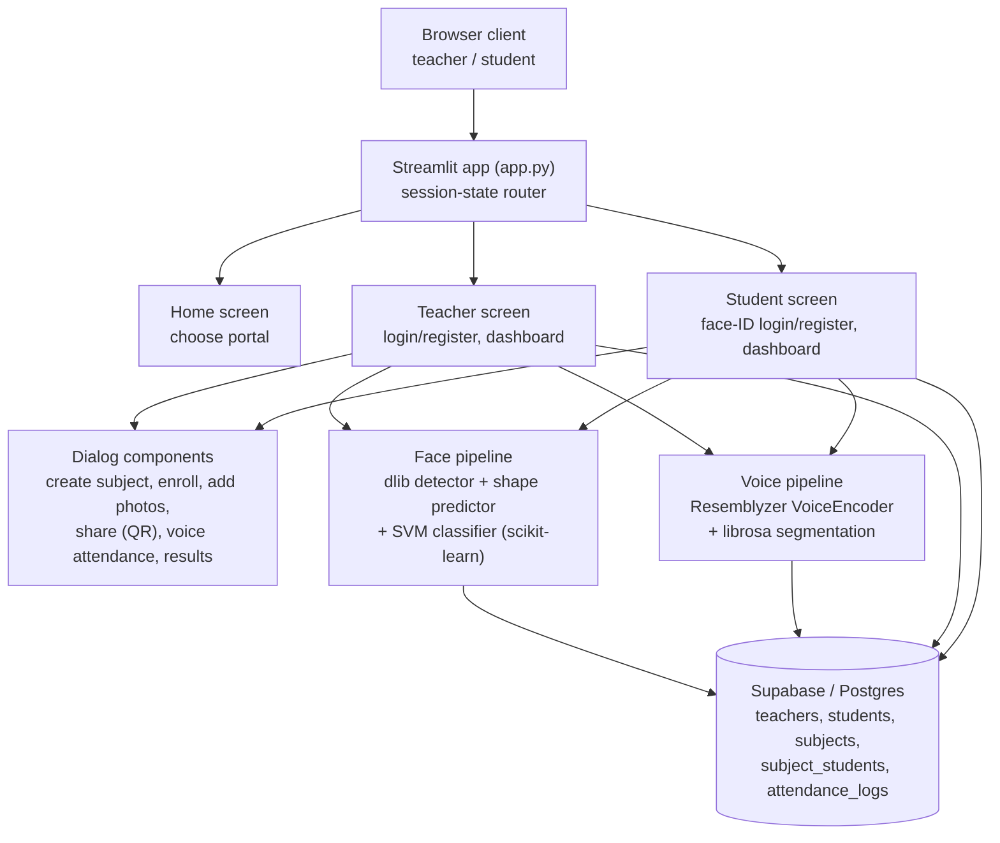
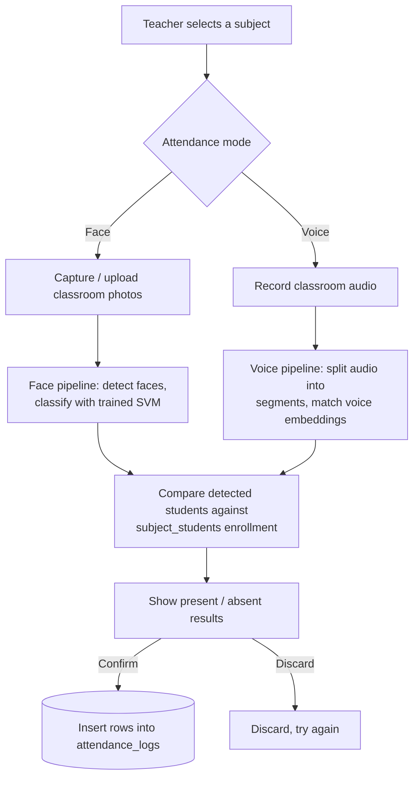
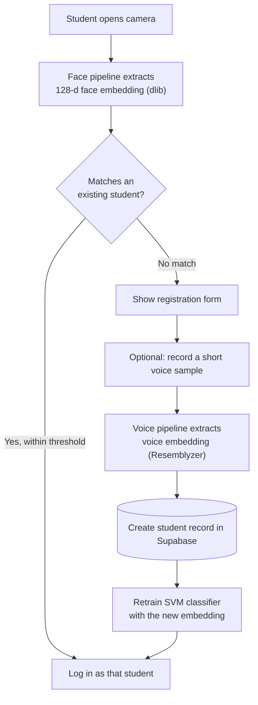
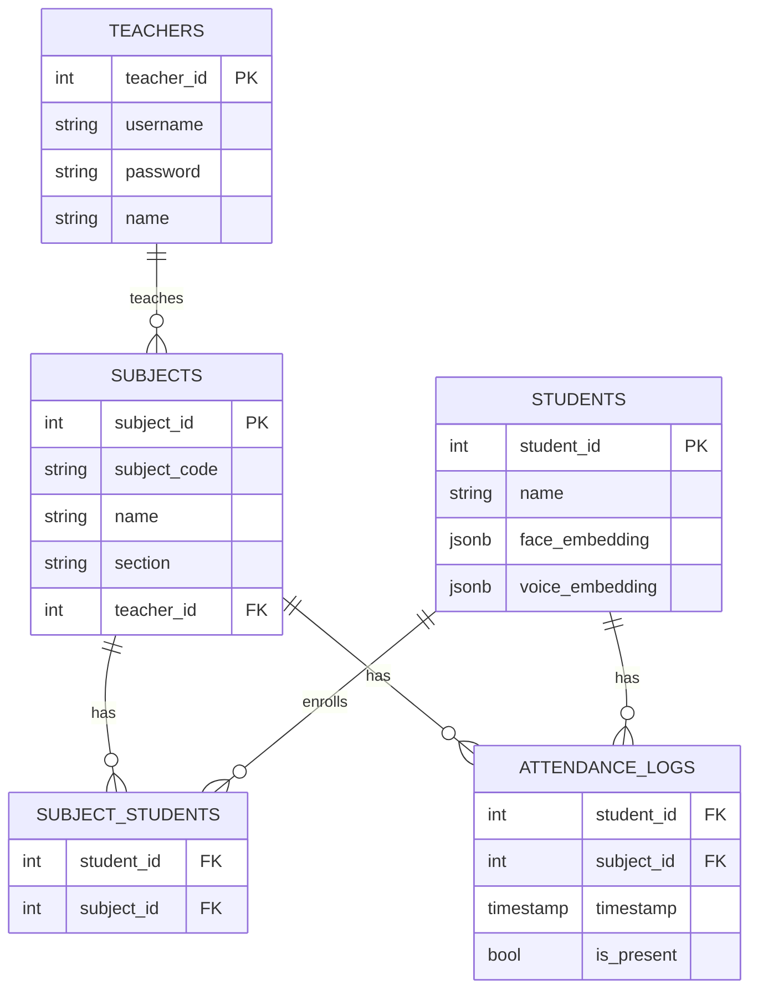

# SmartPresence
 
AI-powered classroom attendance system that recognises students from **face** and **voice**, built with Streamlit and backed by Supabase (Postgres).
 
Created with ❤️ by Divyesh Puranik
 
---
 
## Overview
 
SmartPresence gives a class two portals — **Teacher** and **Student** — inside a single Streamlit app:
 
- Teachers create subjects, share a join code / QR link, and take attendance by scanning classroom **photos** (facial recognition) or a classroom **audio recording** (voice recognition).
- Students log in with their face (no password), optionally enroll their voice, join subjects with a code or QR link, and track their own attendance.
All recognition runs locally in the app process (dlib + scikit-learn for faces, Resemblyzer + librosa for voice); Supabase stores users, subjects, enrollments and attendance logs.
 
## Features
 
**Teacher portal**
- Register / login with a username + bcrypt-hashed password
- Create subjects (code, name, section)
- Share a subject via a join code and an auto-generated QR code
- Take attendance two ways:
  - **Face mode** — capture or upload classroom photos, auto-detect and match every face
  - **Voice mode** — record classroom audio, auto-segment and match every speaker
- Review and confirm results before they're saved
- View attendance records grouped by session, with a present/total summary per class
**Student portal**
- Register by capturing a face photo (creates a 128-d face embedding)
- Optional voice enrollment (short recorded phrase) for voice-based attendance
- Face-ID login — no password, just the camera
- Enroll in subjects via join code, QR scan, or an auto-enroll link (`?join_code=...`)
- View enrolled subjects with attendance stats, and unenroll if needed
## Architecture
 

 
The app is a single Streamlit process — there is no separate backend service. `st.session_state` acts as the in-memory session/router, `src/screens/database/db.py` talks to Supabase directly, and the two pipelines are cached in-process with `@st.cache_resource`.
 
## Core flows
 
### Taking attendance (teacher)
 

 
### Student registration & login
 

 
### Recognition thresholds
- **Face match**: a linear SVM (scikit-learn) is trained on every stored face embedding; a prediction is only accepted if the Euclidean distance to that student's stored embedding is ≤ **0.6**.
- **Voice match**: cosine similarity between the new embedding and a candidate's stored embedding must be ≥ **0.65** to count as a match. For classroom (bulk) audio, the recording is split into speech segments with `librosa.effects.split`, and each segment is matched independently so several speakers can be identified from one recording.
## Database schema (Supabase / Postgres)
 

 
`subject_students` is the enrollment join table between students and subjects; `attendance_logs` gets one row per student per attendance session (a session is identified by its `timestamp`).
 
## Tech stack
 
| Layer | Technology |
|---|---|
| UI / app framework | [Streamlit](https://streamlit.io) |
| Face detection & embeddings | dlib (`dlib-bin`), `face_recognition_models` |
| Face classification | scikit-learn (linear SVM) |
| Voice embeddings | Resemblyzer (`VoiceEncoder`) |
| Audio loading / segmentation | librosa |
| Database & auth storage | Supabase (Postgres) |
| Password hashing | bcrypt |
| QR code generation | segno |
| Data handling | pandas, numpy |
| Images | Pillow |
 
## Project structure
 
```
SmartPresence/
├── app.py                     # Entry point; routes between home/teacher/student screens
├── requirements.txt
└── src/
    └── screens/
        ├── home_screen.py      # Portal chooser
        ├── teacher_screen.py   # Teacher login/register + dashboard (3 tabs)
        ├── student_screen.py   # Student face-ID login/register + dashboard
        ├── components/
        │   ├── header.py
        │   ├── footer.py
        │   ├── subject_card.py
        │   ├── dialog_create_subject.py
        │   ├── dialog_enroll.py
        │   ├── dialog_auto_enroll.py       # Handles ?join_code= deep links
        │   ├── dialog_add_photos.py
        │   ├── dialog_share_subject.py     # QR code + join link
        │   ├── dialog_voice_attendance.py
        │   └── dialog_attendance_results.py
        ├── database/
        │   ├── config.py       # Supabase client
        │   └── db.py           # All CRUD/query functions
        ├── pipelines/
        │   ├── face_pipeline.py    # dlib + SVM
        │   └── voice_pipeline.py   # Resemblyzer + librosa
        └── ui/
            └── base_layout.py  # Shared CSS styling
```
 
## Getting started
 
### Prerequisites
- Python 3.10–3.12 (the project was developed against 3.12)
- A [Supabase](https://supabase.com) project (free tier works)
- A webcam and microphone for face/voice capture in the browser
### Installation
 
```bash
git clone https://github.com/Divyesh-1729/SmartPresence.git
cd SmartPresence
 
python -m venv venv
# Windows
venv\Scripts\activate
# macOS / Linux
source venv/bin/activate
 
pip install -r requirements.txt
```
 
`dlib-bin` installs a prebuilt dlib wheel (no local compiler needed), and `face_recognition_models` is pulled directly from GitHub via the `git+https://...` line in `requirements.txt`.
 
### Configure Supabase
 
Create `.streamlit/secrets.toml` in the project root (this path is already git-ignored):
 
```toml
SUPABASE_URL = "https://YOUR-PROJECT.supabase.co"
SUPABASE_KEY = "YOUR-SUPABASE-KEY"
```
 
Then create the five tables shown in the [schema](#database-schema-supabase--postgres) above in your Supabase project (Table Editor or SQL editor), matching the column names listed.
 
### Run the app
 
```bash
streamlit run app.py
```

## Credits
 
Built by **Divyesh Puranik** ([@Divyesh-1729](https://github.com/Divyesh-1729)).
